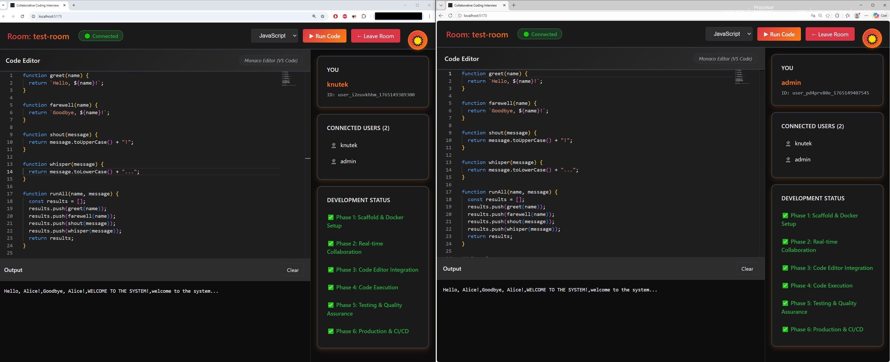

# 🚀 Collaborative Coding Interview Platform

A modern, real-time collaborative coding platform for technical interviews. Built with React, Node.js, Express, Socket.IO, and Monaco Editor (VS Code's editor). Features beautiful dark/light themes and supports JavaScript and Python code execution in the browser.

[](https://render.com)
[](https://www.docker.com/)
[](https://github.com/features/actions)

**🌐 Live Demo:** [https://coding-interview-platform-08jm.onrender.com/](https://coding-interview-platform-08jm.onrender.com/)



## ✨ Features

### 🎨 **Modern UI with Theming**
- **Dark/Light Mode Toggle** - Beautiful red-orange-black dark theme and red-orange-white light theme
- **Gradient Effects** - Professional card-based design with smooth transitions
- **Responsive Layout** - Works on desktop and mobile devices
- **Theme Persistence** - Your theme preference is saved locally

### 👥 **Real-time Collaboration**
- **Multi-user Support** - Multiple users can join the same room
- **Live Code Sync** - See code changes in real-time across all connected users
- **User Presence** - See who's in the room with you
- **Connection Status** - Visual indicators for connection state

### 💻 **Advanced Code Editor**
- **Monaco Editor** - The same editor that powers VS Code
- **Syntax Highlighting** - Support for JavaScript and Python
- **Auto-completion** - Intelligent code suggestions
- **Multiple Languages** - Switch between JavaScript and Python

### ⚡ **Code Execution**
- **JavaScript Execution** - Safe sandboxed execution in isolated iframes
- **Python Execution** - Browser-based Python via Pyodide (WebAssembly)
- **Real-time Output** - See results immediately
- **Error Handling** - Clear error messages with syntax highlighting

### 🧪 **Comprehensive Testing**
- **Integration Tests** - Jest + Supertest for API and Socket.IO
- **E2E Tests** - Playwright for end-to-end scenarios
- **9 Test Suites** - Covering collaboration, execution, and API endpoints

### 🐳 **Production-Ready**
- **Docker-based** - Consistent environments across dev and production
- **Multi-stage Builds** - Optimized production images
- **Health Checks** - Automatic container health monitoring
- **CI/CD Pipeline** - Automated testing and deployment

## 🎯 Tech Stack

### Frontend
- **React 18** - Modern UI library
- **Vite** - Lightning-fast build tool
- **Monaco Editor** - VS Code's editor component
- **Pyodide 0.29.0** - Python in the browser
- **Socket.IO Client** - Real-time communication

### Backend
- **Node.js 20** - JavaScript runtime
- **Express** - Web framework
- **Socket.IO** - WebSocket server
- **Docker** - Containerization

### Testing & CI/CD
- **Jest** - Integration testing
- **Playwright** - E2E testing
- **GitHub Actions** - Continuous integration
- **Render** - Cloud deployment

## 🚀 Quick Start

### Prerequisites

- **Docker Desktop** installed and running
- **Git**
- **Make** (optional, for convenience commands)

### Installation

```bash
# Clone repository
git clone https://github.com/KonuTech/ai-dev-tools-zoomcamp-hw-02.git
cd ai-dev-tools-zoomcamp-hw-02

# Copy environment variables
cp .env.example .env

# Start the application (using Make)
make start

# Or using docker-compose directly
docker-compose up -d
```

### Access the Application

- **Frontend**: http://localhost:5173
- **Backend**: http://localhost:3000
- **Health Check**: http://localhost:3000/health

### Using the App

1. **Open** http://localhost:5173 in your browser
2. **Click** the theme toggle (top-right) to switch between dark/light modes
3. **Enter** your name and a room ID
4. **Click** "Join Room"
5. **Open** another browser/tab with the same room ID to test collaboration
6. **Write** some code and see it sync in real-time
7. **Click** "Run Code" to execute JavaScript or Python

## 📦 Make Commands

View all available commands:
```bash
make help
```

### Development
```bash
make start          # Start application (detached)
make dev            # Start with logs (attached)
make stop           # Stop application
make restart        # Restart application
make build          # Build Docker images
make rebuild        # Clean rebuild (no cache)
```

### Logs & Monitoring
```bash
make logs           # All service logs
make logs-server    # Server logs only
make logs-client    # Client logs only
make ps             # List running containers
make status         # Application status
make health         # Check health endpoint
```

### Testing
```bash
make test           # Run all tests
make test-int       # Integration tests only
make test-e2e       # E2E tests only
make test-quick     # Quick integration test
```

### Production
```bash
make prod-build     # Build production image
make prod-start     # Start production container
make prod-stop      # Stop production
make prod-logs      # Production logs
make prod           # Build and start production
```

### Cleanup
```bash
make clean          # Remove containers and volumes
make clean-all      # Remove everything
make prune          # Remove unused Docker resources
```

## 📁 Project Structure

```
ai-dev-tools-zoomcamp-hw-02/
├── client/                      # React + Vite frontend
│   ├── src/
│   │   ├── app/
│   │   │   ├── App.jsx         # Main app component
│   │   │   ├── useSocket.js    # Socket.IO hook
│   │   │   ├── useTheme.js     # Theme management hook
│   │   │   └── index.css       # Global styles + CSS variables
│   │   ├── components/
│   │   │   ├── CodeEditor.jsx  # Monaco Editor wrapper
│   │   │   ├── OutputConsole.jsx  # Code execution output
│   │   │   └── ThemeToggle.jsx # Dark/Light mode toggle
│   │   ├── pages/
│   │   │   └── Room.jsx        # Collaborative room
│   │   ├── services/
│   │   │   ├── pythonExecutor.js   # Pyodide integration
│   │   │   └── javascriptExecutor.js  # Sandboxed JS execution
│   │   └── main.jsx
│   └── package.json
│
├── server/                      # Express + Socket.IO backend
│   ├── src/
│   │   └── index.js            # Server + Socket.IO handlers
│   ├── tests/
│   │   ├── socket.test.js      # Socket.IO integration tests
│   │   └── api.test.js         # HTTP endpoint tests
│   └── package.json
│
├── e2e/                         # Playwright E2E tests
│   └── tests/
│       ├── collaboration.spec.js  # Real-time collaboration tests
│       └── execution.spec.js      # Code execution tests
│
├── docker/
│   ├── Dockerfile              # Production multi-stage build
│   └── Dockerfile.dev          # Development environment
│
├── .github/workflows/
│   └── ci-cd.yml               # GitHub Actions CI/CD
│
├── docker-compose.yml          # Development environment
├── docker-compose.prod.yml     # Production environment
├── docker-compose.test.yml     # Testing environment
├── Makefile                    # Convenience commands
├── render.yaml                 # Render deployment config
├── DEPLOYMENT.md               # Deployment guide
└── AGENTS.md                   # Development workflow
```

## 🧪 Testing

### Integration Tests (9 tests)

```bash
make test-int
```

**Socket.IO Tests:**
- ✅ Server starts and accepts connections
- ✅ Users can join rooms
- ✅ Code changes sync between users
- ✅ Language changes sync
- ✅ Multiple users in same room
- ✅ User presence tracking

**API Tests:**
- ✅ Health endpoint returns 200
- ✅ Correct content type
- ✅ 404 handling

### E2E Tests

```bash
make test-e2e
```

**Collaboration Tests:**
- ✅ Room joining and connection
- ✅ Multi-user code synchronization
- ✅ Language switching

**Execution Tests:**
- ✅ JavaScript code execution
- ✅ Python code execution (with Pyodide)
- ✅ Error handling
- ✅ Output clearing

## 🎨 Themes

### Dark Mode (Red-Orange-Black)
- Background: Deep blacks (#0d0d0d, #1a1a1a)
- Accents: Red (#dc3545) and Orange (#fd7e14)
- Text: Light gray (#e9ecef)
- Effects: Glowing orange shadows

### Light Mode (Red-Orange-White)
- Background: Clean whites (#ffffff, #f8f9fa)
- Accents: Red (#dc3545) and Orange (#fd7e14)
- Text: Dark gray (#1a1a1a)
- Effects: Subtle shadows

## 🌐 Deployment

### Deployed on Render

The application is live and deployed on Render with automatic deployments from the `main` branch.

**🌐 Live Application:** [https://coding-interview-platform-08jm.onrender.com/](https://coding-interview-platform-08jm.onrender.com/)

**Deployment Configuration:**
- **Platform**: Render
- **Region**: Frankfurt
- **Environment**: Docker
- **Health Check**: `/health`
- **Auto-deploy**: Enabled
- **URL**: https://coding-interview-platform-08jm.onrender.com/

### Deploy Your Own

See [DEPLOYMENT.md](./DEPLOYMENT.md) for detailed deployment instructions for:
- **Render** (recommended)
- **Railway**
- **Fly.io**
- **DigitalOcean**
- **Self-hosted VPS**

### Production Build

```bash
# Build production image
make prod-build

# Start production locally
make prod-start

# Access at http://localhost:3000
```

## 📋 Environment Variables

### Development (`.env`)
```env
NODE_ENV=development
PORT=3000
CLIENT_URL=http://localhost:5173
VITE_SERVER_URL=http://localhost:3000
```

### Production (`.env.production`)
```env
NODE_ENV=production
PORT=3000
```

## 🏗️ Development Phases

All phases completed! ✅

- ✅ **Phase 1**: Scaffold & Docker Setup
- ✅ **Phase 2**: Real-time Collaboration (Socket.IO)
- ✅ **Phase 3**: Code Editor Integration (Monaco)
- ✅ **Phase 4**: Code Execution (Pyodide + Sandbox)
- ✅ **Phase 5**: Testing & Quality Assurance
- ✅ **Phase 6**: Production & CI/CD

## 🔧 Troubleshooting

### Port Already in Use

```bash
make clean
# Or manually:
docker-compose down
lsof -ti:3000 | xargs kill -9
lsof -ti:5173 | xargs kill -9
```

### Container Won't Start

```bash
make logs
# Check for errors in the logs
```

### Clear Everything and Restart

```bash
make clean-all
make build
make start
```

### Theme Not Persisting

Clear browser localStorage and refresh:
```javascript
localStorage.clear()
location.reload()
```

## 📚 Documentation

- **[DEPLOYMENT.md](./DEPLOYMENT.md)** - Comprehensive deployment guide
- **[AGENTS.md](./AGENTS.md)** - Development workflow and conventions
- **[Makefile](./Makefile)** - All available commands with descriptions

## 🤝 Contributing

This project was developed as part of the AI & Dev Tools Zoomcamp. Contributions, issues, and feature requests are welcome!

### Development Workflow

1. Create a feature branch
2. Make changes with hot-reload enabled
3. Run tests: `make test`
4. Commit with conventional commits
5. Push and create PR

## 📄 License

MIT

## 🙏 Acknowledgments

- Built with guidance from the **AI & Dev Tools Zoomcamp**
- Developed with **Claude Code** by Anthropic
- Icons and emojis from **Unicode Consortium**

---

**Ready to conduct your next coding interview?** 🎯

Start collaborating in real-time with beautiful themes and powerful code execution!
